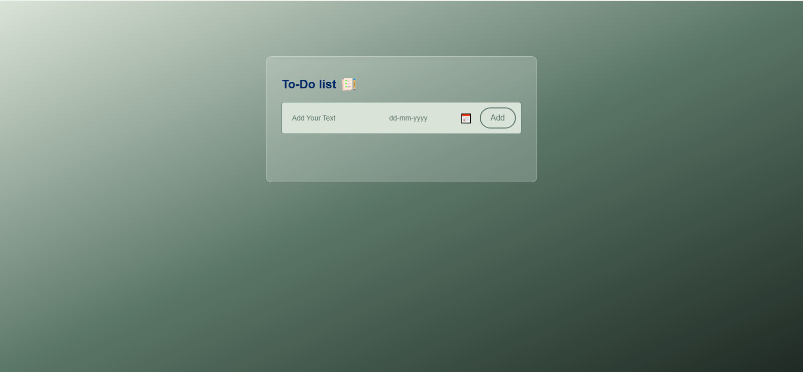

# 📝 PlanItList

**PlanItList** is a simple and clean web app that helps users organize their tasks, plans, or daily checklist. Built using HTML, CSS, and JavaScript, and hosted on **Netlify**.

🌐 [Live Demo](https://planitlist.netlify.app)

---

## 🚀 Features

- ✅ Add tasks to your list  
- ✏️ Edit or delete tasks  
- 📌 Mark tasks as completed  
- 💻 Mobile-responsive and clean UI  
- ⚡ Fast and lightweight  

---

## 📸 Screenshots

 - Desktop
 

---

## 💻 Tech Stack

- HTML5  
- CSS3  
- Vanilla JavaScript  
- Hosted on Netlify  

---
